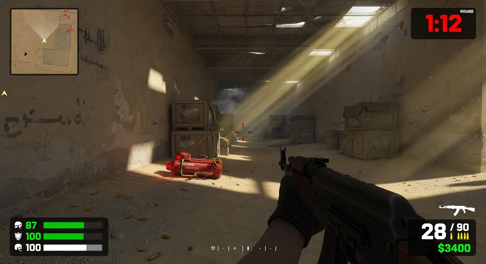

# CS: Better

**Counter-Strike but better.** A fully playable, browser-based tactical FPS with deterministic gunplay, procedural audio, and deep MemeTorrent P2E integration.

Play instantly in any modern browser. No downloads. No installs. Just click and frag.



[](https://vercel.com/new/clone?repository-url=https%3A%2F%2Fgithub.com%2Fyourusername%2Fcs-better)

<!-- After creating your GitHub repo, replace "yourusername" above with your actual username -->

> **See full deployment instructions:** [DEPLOY.md](./DEPLOY.md)

---

## Features

- **True 3D first-person tactical shooter** built with Three.js
- **Deterministic recoil patterns** — learn the spray, master the AK. 100% predictable (no RNG)
- **Full CS-style gameplay**: Buy phase, economy, bomb defusal (A/B sites), one-life rounds
- **Smart bots** that move, peek, shoot back, and even plant the bomb
- **Procedural audio** — every gunshot, footstep, and reload is synthesized live (crisp, unique, no asset files)
- **Polished HUD**: Radar, killfeed, health/armor, ammo, money, round timer, customizable crosshair
- **Modern movement**: Momentum, bunnyhop potential, crouch, walk, jump
- **Wallet-connected P2E** — earn and claim **Rockets** for the MemeTorrent ecosystem

### MemeTorrent P2E Integration (by memetorrent & futuret3ch)

**Wallet connect enabled** for:
- Phantom
- Solflare
- Backpack

**How it works:**
- Earn **🚀 Rockets** by:
  - Killing bots (15 base, +10 on headshots)
  - Planting the bomb (+120)
  - Defusing the bomb (+180)
  - Winning rounds with good performance
- Connect your Solana wallet from the main menu or the top HUD pill
- Use the **CLAIM** button to cryptographically sign and submit your score
- Rockets feed into the MemeTorrent P2E Arcade (rewards, airdrops, leaderboards, engagement)

$MT token: `ELywDcVX2WumHm4xEfqF8NdEKaeGCAaq9JmwtjE8pump`

Your signed claims are verifiable proof of participation in the MT ecosystem.

---

## Controls

| Action             | Input                          |
|--------------------|--------------------------------|
| Move               | WASD                           |
| Jump               | Space                          |
| Crouch             | Ctrl or C (hold)               |
| Walk (silent)      | Shift (hold)                   |
| Shoot              | Left Mouse                     |
| Aim / Scope        | Right Mouse                    |
| Reload             | R                              |
| Weapon Switch      | 1–5 or Mouse Wheel             |
| Buy Menu           | B (during buy phase)           |
| Plant / Defuse     | E (hold near site or bomb)     |
| Pause / Menu       | Esc                            |
| Lock Mouse         | Click the game area            |

**Pro tip:** The AK recoil is fully deterministic. Practice your spray on a wall.

**Dev cheats:** Press `9` for free money + AK. Press `=` to add test Rockets.

---

## Play Instantly

### Local (Recommended for testing)

```bash
# Clone
git clone https://github.com/YOUR_USERNAME/cs-better.git
cd cs-better

# Run (pick one)
python -m http.server 8080
# or
npx serve
```

Open **http://localhost:8080** in **Chrome** (best support for mouse lock + audio + wallets).

### Live Demo

After deploying (see [DEPLOY.md](./DEPLOY.md)), replace the Vercel button and add your live URL here.

---

## Project Structure

```
cs-better/
├── index.html          # Game shell + HUD + meta tags
├── style.css           # Tactical dark UI theme
├── manifest.json       # PWA manifest (fullscreen mode)
├── vercel.json         # Vercel static deploy config + headers
├── LICENSE             # MIT
├── .gitignore
├── README.md
├── DEPLOY.md           # GitHub + Vercel deployment guide
├── GAME_DESIGN.md      # Full original design doc
├── assets/
│   └── preview.jpg     # Social preview image
└── js/
    ├── three.min.js    # Vendored Three.js (r134)
    ├── solana-web3.min.js # Vendored Solana web3.js
    ├── wallet.js       # Phantom / Solflare / Backpack + Rockets claiming
    ├── audio.js        # Procedural Web Audio (guns, steps, UI)
    ├── weapons.js      # Weapon data + fixed recoil tables
    ├── entities.js     # Player + Bot AI + collision
    ├── map.js          # Dust II Mini level builder
    ├── ui.js           # HUD, radar, buy menu, settings, modals
    ├── game.js         # Core loop, shooting, rounds, bomb logic, MT integration
    └── main.js         # Three.js bootstrap + input + menu wiring
```

---

## Development

- Pure vanilla JavaScript + Three.js. No bundler, no build step.
- Open DevTools → Console for `window.game` (full game state) and debugging.
- All game logic is in `js/game.js`. Recoil tables live in `js/weapons.js`.
- Wallet logic (connect + signMessage for claims) is in `js/wallet.js`.
- Rockets are tracked in-memory + persisted per wallet in localStorage.

**Adding new weapons or changing recoil** is as simple as editing the data in `weapons.js` and refreshing.

---

## Tech Stack

- Three.js (3D rendering)
- Web Audio API (procedural sound)
- Pointer Lock API (mouse look)
- Solana browser wallets (Phantom, Solflare, Backpack)
- Pure static files — works on Vercel, Netlify, GitHub Pages, etc.

---

## Deployment

**Full instructions (GitHub repo creation + Vercel):**  
See [DEPLOY.md](./DEPLOY.md)

**Quick Vercel deploy:**
1. Push the folder to GitHub.
2. Click the Deploy button above (or import on vercel.com).
3. Update the button + demo link in this README after your first deploy.

Vercel provides the HTTPS required for wallet signing and pointer lock.

---

## Roadmap

See [GAME_DESIGN.md](./GAME_DESIGN.md) for the original full vision.

Current priorities:
- Grenades (HE, Flash, Smoke)
- More weapons + improved buy menu
- Second map
- Better bot AI + personalities
- On-chain claim improvements / leaderboards
- Full crosshair editor

---

## Credits

**Core game** built as an ambitious interactive project with Grok.

**MemeTorrent P2E wallet integration + Rockets system** created by **memetorrent** and **futuret3ch**.

$MT ecosystem: [memetorrent.futuret3ch.com.au](https://memetorrent.futuret3ch.com.au/)

---

**GLHF. Headshots only. 🚀**

Made to be forked, played, deployed, and extended. Have fun!
